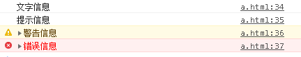
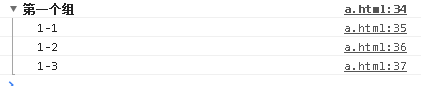
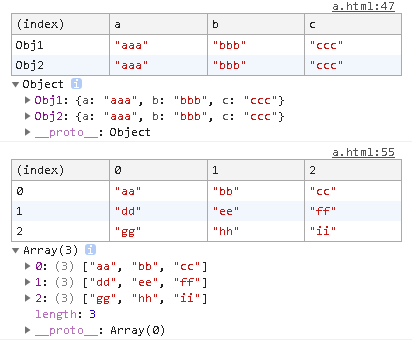
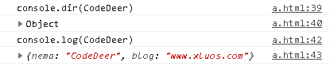
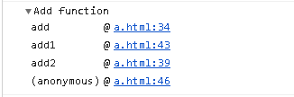
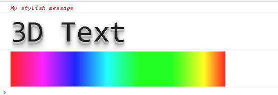

## 一、分类输出
    console.log('文字信息');
    console.info('提示信息');
    console.warn('警告信息');
    console.error('错误信息');
打印结果：   

## 二、分组输出
使用Console.group()和Console.groupEnd()包裹分组内容。

    console.group('第一个组');
        console.log("1-1");
        console.log("1-2");
        console.log("1-3");
    console.groupEnd();
打印结果：

>1、还可以使用Console.groupCollapsed()来代替Console.group()生成折叠的分组。   
2、Console.group()还可以嵌套使用
## 三、表格输出
使用console.table()可以将传入的对象，或数组以表格形式输出。适合排列整齐的元素。   

    var Obj = {
        Obj1: {
            a: "aaa",
            b: "bbb",
            c: "ccc"
        },
        Obj2: {
            a: "aaa",
            b: "bbb",
            c: "ccc"
        }
    }
    console.table(Obj);

    var Arr = [
        ["aa","bb","cc"],
        ["dd","ee","ff"],
        ["gg","hh","ii"],
    ]
    console.table(Arr);
打印结果：

## 四、查看对象
使用Console.dir()显示一个对象的所有属性和方法   
在Chrome中Console.dir()和Console.log()效果相同

    var CodeDeer = {
        nema: 'CodeDeer',
        blog: 'www.xluos.com',
            
    }
    console.log("console.dir(CodeDeer)");
    console.dir(CodeDeer);

    console.log("console.log(CodeDeer)");
    console.log(CodeDeer);
打印结果：

## 五、条件输出
当第一个参数或返回值为真时，不输出内容   
当第一个参数或返回值为假时，输出后面的内容并抛出异常

    console.assert(true, "你永远看不见我");
    console.assert((function() { return true;})(), "你永远看不见我");

    console.assert(false, "你看得见我");
    console.assert((function() { return false;})(), "你看得见我");
## 六、计次输出
使用Console.count()输出内容和被调用的次数   
此方法可以接受一个参数作为标签，为执行次数进行分类:

    function fun(vari){
        console.count("fun方法调用次数")
    }
    fun("aaa")
    fun(123)
    fun("aaa")
打印结果：

    fun方法: 1
    fun方法: 2
    fun方法: 3  
## 七、追踪调用堆栈
使用Console.trace()来追踪函数被调用的过程，在复杂项目时调用过程非常多，用这个命令来帮你缕清。   

    function add(a, b) {
        console.trace("Add function");
        return a + b;
    }

    function add2(a, b) {
        return add1(a, b);
    }

    function add1(a, b) {
        return add(a, b);
    }

    var x = add2(1, 1);
打印结果：   

## 八、计时功能
使用Console.time()和Console.timeEnd()包裹需要计时的代码片段，输出运行这段代码的时间。
* Console.time()中的参数作为计时器的标识，具有唯一性。 
* Console.timeEnd()中的参数来结束此标识的计时器，并以毫秒为单位返回运行时间。   
* 最多同时运行10000个计时器。

        console.time("Chrome中循环1000次的时间");
        for(var i = 0; i < 1000; i++)
        {

        }
        console.timeEnd("Chrome中循环1000次的时间");
打印结果：

        Chrome中循环1000次的时间: 0.10888671875ms
## 九、格式化输出
占位符|含义 
---|---  
%s|字符串输出   
%d or %i|整数输出   
%f|浮点数输出   
%o|打印javascript对象，可以是整数、字符串以及JSON数据

        var arr = ["小明", "小红"];

        console.log("欢迎%s和%s两位新同学",arr[0],arr[1]);
        // 欢迎小明和小红两位新同学

        console.log("圆周率整数部分：%d，带上小数是：%f",3.1415,3.1415);
        // 圆周率整数部分：3，带上小数是：3.1415

        var person = {
            name:"jack",
            age:18
        }
        console.log('hi, my friend is %o',person)
        // hi, my friend is {name: "jack", age: 18}
## 十、自定义样式
使用%c为打印内容定义样式,再输出信息前加上%c，后面写上标准的css样式，就可以为输出的信息添加样式了。

    console.log("%cMy stylish message", "color: red; font-style: italic");

    console.log("%c3D Text", " text-shadow: 0 1px 0 #ccc,0 2px 0 #c9c9c9,0 3px 0 #bbb,0 4px 0 #b9b9b9,0 5px 0 #aaa,0 6px 1px rgba(0,0,0,.1),0 0 5px rgba(0,0,0,.1),0 1px 3px rgba(0,0,0,.3),0 3px 5px rgba(0,0,0,.2),0 5px 10px rgba(0,0,0,.25),0 10px 10px rgba(0,0,0,.2),0 20px 20px rgba(0,0,0,.15);font-size:5em");

    console.log('%cRainbow Text ', 'background-image:-webkit-gradient( linear, left top, right top, color-stop(0, #f22), color-stop(0.15, #f2f), color-stop(0.3, #22f), color-stop(0.45, #2ff), color-stop(0.6, #2f2),color-stop(0.75, #2f2), color-stop(0.9, #ff2), color-stop(1, #f22) );color:transparent;-webkit-background-clip: text;font-size:5em;');
打印结果：
